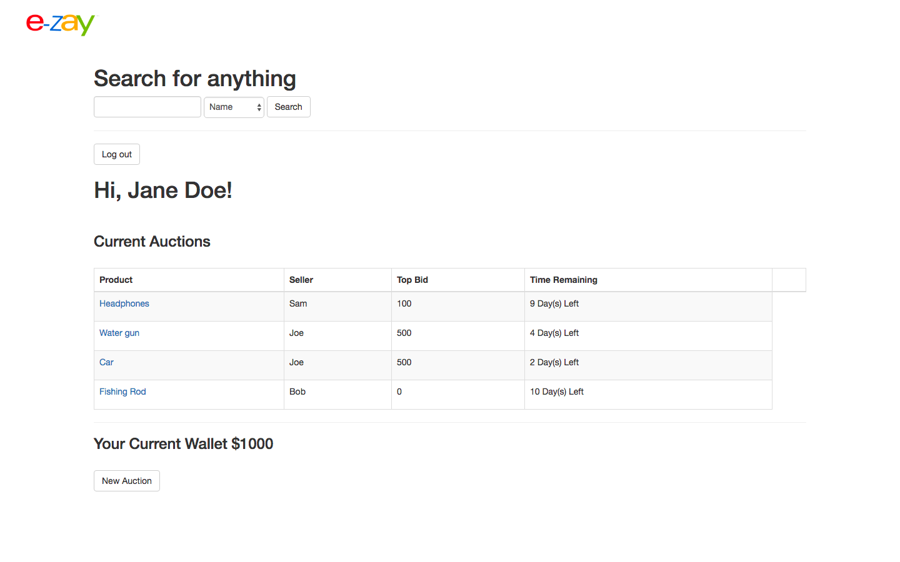

# eZay C#/.Net Project
eBay Web Application using C#/.Net Stack
## Overview
eBay is a web e-commerce marketplace where millions of people trade every day. Some are buyers, some are sellers, some are both. This project contains C#, .NET, MVC, ORM and Entity Core. This project timeline: 1 Week; SCRUM methodology.

## Usage
`` git clone: https://github.com/samq1/CSharpProject_eBay.git ``

## Build
Prerequisites:

.NET Core SDK (>1.1)

Run dotnet build from the solution directory.

## Dependencies

```
  "Microsoft.AspNetCore.Diagnostics": "1.1.1",
  "Microsoft.AspNetCore.Identity": "1.0.0",
  "Microsoft.AspNetCore.Mvc": "1.1.2",
  "Microsoft.AspNetCore.Server.Kestrel": "1.1.1",
  "Microsoft.AspNetCore.Session": "1.1.1",
  "Microsoft.AspNetCore.StaticFiles": "1.1.1",
  "Microsoft.EntityFrameworkCore.Tools": "1.1.1",
  "Microsoft.EntityFrameworkCore.Tools.DotNet": "1.0.1",
  "Microsoft.Extensions.Configuration.Json": "1.1.0",
  "Microsoft.Extensions.Logging.Console": "1.1.1",
  "Microsoft.NETCore.App": "1.1.2",
  "MySql.Data": "7.0.7-m61",
  "Npgsql.EntityFrameworkCore.PostgreSQL": "1.1.0",
  "System.Data.SqlClient": "4.1.0",
  "Twitter.Bootstrap": "3.0.1.1"
  
 ```
## Technology
- Database: PostgresDB
- C#
- .Net Core
- Twitter Boostrap



